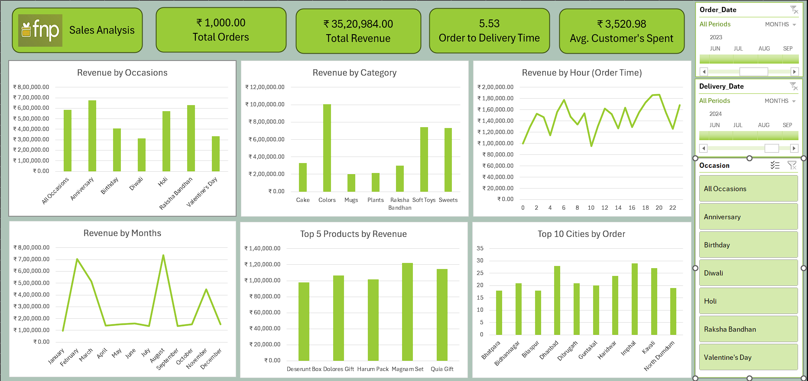

# Sales Analysis Dashboard (Excel)

## Overview
This project presents an interactive **Sales Analysis Dashboard** built in Microsoft Excel to provide a high-level yet actionable view of sales performance across time, products, occasions, and geography.

The dashboard consolidates key sales, order, delivery, and customer spending metrics into a single decision-support interface, enabling faster and more informed business decisions.

---

## Key Performance Indicators (KPIs)
- Total Orders: 1,000  
- Total Revenue: ₹35.2 Lakhs  
- Average Order to Delivery Time: 5.53 days  
- Average Customer Spend: ₹3,520.98  

These KPIs provide a quick snapshot of overall business volume, operational efficiency, and customer purchasing behavior.

---

## Sales & Revenue Analysis

### Revenue by Occasion
Anniversary and Raksha Bandhan generate the highest revenue, highlighting strong demand for gifting occasions.  
Diwali and Valentine’s Day show comparatively lower revenue, indicating opportunities for targeted promotional strategies.

**Insight:** Occasion-based campaigns significantly impact revenue and should be prioritized in marketing planning.

---

### Revenue by Category
Colors and Soft Toys are the top-performing categories, followed by Sweets and Raksha Bandhan items.  
Categories such as Mugs and Plants contribute relatively lower revenue.

**Insight:** High-performing categories should receive focused inventory and promotion, while low-performing categories may require repositioning.

---

### Revenue by Hour (Order Time)
Sales peak during mid-day to evening hours, indicating higher customer engagement during these time slots.  
Early morning and late-night hours show lower order values.

**Insight:** Marketing campaigns and advertisements should be scheduled during high-conversion hours to maximize ROI.

---

### Monthly Revenue Trend
Revenue peaks during February and August, indicating strong seasonal demand.  
Lower sales are observed in April, May, and July, representing off-season periods.

**Insight:** Seasonal trends should be considered in forecasting, inventory planning, and promotional timing.

---

## Product & Geographic Performance

### Top Products by Revenue
Products such as Magnam Set, Quia Gift, and Harum Pack are the highest revenue contributors.  
Revenue distribution among top products is balanced, reducing dependency on a single product.

**Insight:** These products are suitable for bundling and cross-selling strategies.

---

### Top Cities by Orders
Cities including Imphal, Kavali, and Dhanbad record the highest order volumes.  
Order distribution reflects regional diversity rather than reliance on a single metro city.

**Insight:** Expanding logistics and targeted marketing in high-order cities can further boost revenue.

---

## Tools & Techniques Used
- Microsoft Excel  
- Pivot Tables and Pivot Charts  
- Slicers for interactive filtering  
- Calculated Fields and KPIs  
- Data Cleaning and Transformation  

---

## Dashboard Preview

---

## Conclusion
This dashboard transforms raw sales data into meaningful business insights, helping stakeholders identify high-value occasions and products, optimize marketing timing, improve inventory and delivery planning, and better understand customer spending patterns.

The project demonstrates strong skills in Excel-based data analysis, dashboard design, KPI development, and business storytelling.
